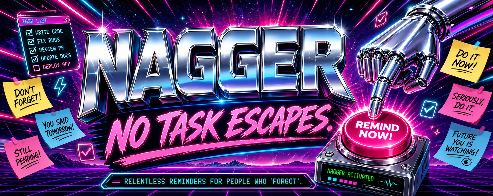

# Nagger

**FEEL LIKE SOMETHING IS MISSING?** Appointments slipping away? Commitments falling through the cracks? No one around to **NAG** you when you forget?

**NAGGER** IS THE SOLUTION.

Hand **NAGGER** to your personal-assistant LLM. Tell it to store your important tasks and notifications. Then let **NAGGER** deliver the daily reminder rundown of everything coming up.

**NAGGER:** because tomorrow is too late to remember.

## Current Scope

The implemented vertical slice supports:

- creating active one-shot tasks;
- completing, pausing, resuming, and cancelling one-shot tasks;
- persisting them in SQLite; and
- reporting due-today, overdue, and upcoming tasks for a requested date.

Recurring tasks, reminder delivery, shopping, and deployment automation are not implemented yet.

## Prerequisites

- .NET 10 SDK

## Run Locally

Start the host with its development launch profile:

```bash
dotnet run --project src/Nagger.Host
```

It listens on `http://localhost:5246`. To run without a launch profile, use:

```bash
dotnet run --project src/Nagger.Host --no-launch-profile
```

Without a launch profile, the default address is `http://127.0.0.1:5000`.

The host applies EF Core migrations on startup. Its SQLite database is created at the configured database path.

## API Quickstart

Create a one-shot task. `dueAt` must be an ISO-8601 date-time with an explicit UTC offset, and `reminderPolicy` must be `none`, `once`, or `weekly-until-done`.

```bash
curl -i http://localhost:5246/tasks/one-shot \
  --request POST \
  --header 'Content-Type: application/json' \
  --data '{"title":"Pay rent","dueAt":"2026-08-04T09:00:00+03:00","reminderPolicy":"once"}'
```

A successful request returns `201 Created` and the persisted task. Invalid input returns `400 Bad Request` with an `errors` object keyed by field name.

Request a morning report for a calendar date:

```bash
curl 'http://localhost:5246/reports/morning?date=2026-08-04'
```

The response contains a `schemaVersion`, `generatedAt`, the requested `date`, summary counts for `dueToday`, `overdue`, and `upcoming`, and item details for due-today and overdue tasks. Upcoming tasks contribute only to the summary. Report reads do not modify tasks, reminder state, or timestamps.

## Configuration

| Setting | Default | Environment variable |
| --- | --- | --- |
| `Nagger:DatabasePath` | `nagger.db` | `Nagger__DatabasePath` |
| `Nagger:TimeZone` | `Europe/Helsinki` | `Nagger__TimeZone` |

The configured IANA timezone determines the local calendar date used to classify each task in a morning report.

## Development

Build the solution:

```bash
dotnet build Nagger.slnx
```

Run all tests:

```bash
dotnet test Nagger.slnx
```

Run a focused test project:

```bash
dotnet test tests/Nagger.Core.Tests/Nagger.Core.Tests.csproj
dotnet test tests/Nagger.Host.Tests/Nagger.Host.Tests.csproj
```

Host integration tests use temporary SQLite databases and do not require a running service.

## Architecture

`src/Nagger.Core` contains task behavior, vertical feature slices, and the persistence/time ports it requires. It does not depend on ASP.NET Core, EF Core, configuration, or the system clock.

`src/Nagger.Host` is the Minimal API adapter and composition root. It maps HTTP requests to Core features, provides SQLite and clock adapters, and owns EF Core mappings and migrations.

## Further Reading

- [API usage reference](USAGE.md)
- [One-shot task creation contract](openspec/specs/one-shot-task-creation/spec.md)
- [Morning task report contract](openspec/specs/morning-task-report/spec.md)
- [Product design](docs/product-design.md)
